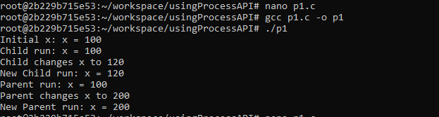
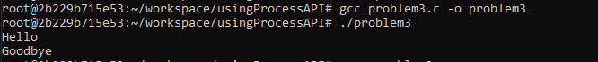

# Assignment: Practicing the Process API
Practicing with fork, exec, wait. 

### Overview

In this assignment, you will practice using the Process API to create processes and run programs under Linux. The goal is to gain hands-on experience with system calls related to process management. Specifically, you will practice using the unix process API functions 'fork()', 'exec()', 'wait()', and 'exit()'. 

⚠️ Note: This is not an OS/161 assignment. You will complete it directly on Linux. 

Use the Linux in your CSE4001 container. If you are using macOS, you may use the Terminal (you may need to install development tools with C/C++ compilers). 

**Reference Reading**: Arpaci-Dusseau, *Operating Systems: Three Easy Pieces*, Chapter 5 (Process API Basics)
 👉 [Chapter 5 PDF](http://pages.cs.wisc.edu/~remzi/OSTEP/cpu-api.pdf)

---

### **Steps to Complete the Assignment**

1. **Accept the GitHub Classroom Invitation**
    [GitHub Link](https://classroom.github.com/a/FZh4BrQG)
2. **Set up your Repository**
   - Clone the assignment repository.
3. **Study the Reference Materials**
   - Read **Chapter 5**.
   - Download and explore the sample programs from the textbook repository:
      [OSTEP CPU API Code](https://github.com/remzi-arpacidusseau/ostep-code/tree/master/cpu-api).
4. **Write Your Programs**
   - Adapt the provided example code to answer the assignment questions.
   - Each program should be clear, well-commented, and compile/run correctly.
   - Add your solution source code to the repository.

5. **Prepare Your Report**
   - Answer the questions in the README.md file. You must edit the README.md file and not create another file with the answers. 
   - For each question:
     - Include your **code**.
     - Provide your **answer/explanation**.
6. **Submit Your Work via GitHub**
   - Push both your **program code** to your assignment repository.
   - This push will serve as your submission.
   - Make sure all files, answers, and screenshots are uploaded and rendered properly.


---
### Questions
1. Write a program that calls `fork()`. Before calling `fork()`, have the main process access a variable (e.g., x) and set its value to something (e.g., 100). What value is the variable in the child process? What happens to the variable when both the child and parent change the value of x?


```cpp
#include <stdio.h>
#include <stdlib.h>
#include <unistd.h>
#include <sys/wait.h>
int
main(int argc, char *argv[])
{
  int x = 100;

    printf("Initial x: x = %d\n", x);

    int rc = fork();

    if (rc < 0) {
        // fork failed; exit
        fprintf(stderr, "fork failed\n");
        exit(1);
    } else if (rc == 0) {
        // child path changing x
        printf("Child run: x = %d\n", x);
        x = 120;
        printf("Child changes x to %d\n", x);
        printf("New Child run: x = %d\n", x);
    } else {
        // parent path changing x
        int rc_wait = wait(NULL); //Wait for child process to finish
        printf("Parent run: x = %d\n", x);
        x = 200;
        printf("Parent changes x to %d\n", x);
        printf("New Parent run: x = %d\n", x);
    }
    return 0;
}```
```
.
1 answer: The variable in the child process is 100 to start with, so is the parent. Once the child function runs, it can change the variable x to 120 and print that as x. This does not change the parent's variable x as 100, due to the process being duplicated from the fork. When the parent's variable x changes, the value becomes 200, but does not impact the child's variable x.

2. Write a program that opens a file (with the `open()` system call) and then calls `fork()` to create a new process. Can both the child and parent access the file descriptor returned by `open()`? What happens when they are writing to the file concurrently, i.e., at the same time?

```cpp
// Add your code or answer here. You can also add screenshots showing your program's execution.  
```

3. Write another program using `fork()`.The child process should print “hello”; the parent process should print “goodbye”. You should try to ensure that the child process always prints first; can you do this without calling `wait()` in the parent?

```cpp
// #include <stdio.h>
#include <stdlib.h>
#include <unistd.h>
#include <sys/wait.h>
int
main(int argc, char *argv[])
{

    int rc = fork();

    if (rc < 0) {
        // fork failed; exit
        fprintf(stderr, "fork failed\n");
        exit(1);
    } else if (rc == 0) {
        // child path
        printf("Hello\n");
    } else {
        // parent path
        int rc_wait = wait(NULL); //Wait for child process to finish
        printf("Goodbye\n");

    }
    return 0;
}  
```

3 Answer: To have the child process print first, you must use the wait() command, unless you create a pipe for the parent before the fork. After the fork, close the writing part of the parent and then the reading part of the child in order to rearrange the order of printing.

4. Write a program that calls `fork()` and then calls some form of `exec()` to run the program `/bin/ls`. See if you can try all of the variants of `exec()`, including (on Linux) `execl()`, `execle()`, `execlp()`, `execv()`, `execvp()`, and `execvpe()`. Why do you think there are so many variants of the same basic call?

```cpp
// Add your code or answer here. You can also add screenshots showing your program's execution.  
```

5. Now write a program that uses `wait()` to wait for the child process to finish in the parent. What does `wait()` return? What happens if you use `wait()` in the child?

```cpp
// #include <stdio.h>
#include <stdlib.h>
#include <unistd.h>
#include <sys/wait.h>
int
main(int argc, char *argv[])
{

    int rc = fork();

    if (rc < 0) {
        // fork failed; exit
        fprintf(stderr, "fork failed\n");
        exit(1);
    } else if (rc == 0) {
        // child path
        printf("Hello\n");
    } else {
        // parent path
        int rc_wait = wait(NULL); //Wait for child process to finish
        printf("Goodbye\n");

    }
    return 0;
}  
```
5 Answer: This code is the same as number 3 since it uses a wait() function already. Wait returns the PID of the child function if it succeeds; however, if it fails, wait() returns -1. If the wait() function is in the child function, wait() returns immediately if it succeeds. If not, the code returns an error.
6. Write a slight modification of the previous program, this time using `waitpid()` instead of `wait()`. When would `waitpid()` be useful?

```cpp
// Add your code or answer here. You can also add screenshots showing your program's execution.  
```

7. Write a program that creates a child process, and then in the child closes standard output (`STDOUT FILENO`). What happens if the child calls `printf()` to print some output after closing the descriptor?

```cpp
// Add your code or answer here. You can also add screenshots showing your program's execution.  
```

